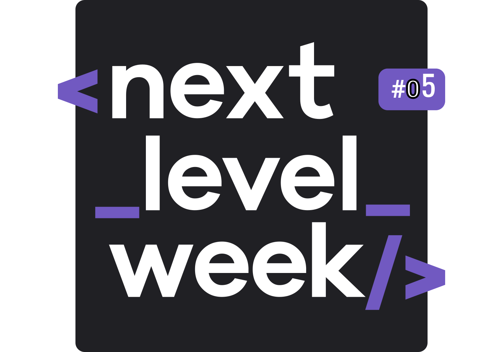

<p  align="center"></img></p>

<p align="center">
  <image 
  src="https://img.shields.io/github/languages/count/JCDMeira/podcastr-nlw5"
  />
  <image 
  src="https://img.shields.io/github/languages/top/JCDMeira/podcastr-nlw5" 
  />
  <image 
  src="https://img.shields.io/github/last-commit/JCDMeira/podcastr-nlw5" 
  />
  <image 
  src="https://img.shields.io/github/watchers/JCDMeira/podcastr-nlw5?style=social" 
  />
</p>

# 📋 Indíce 
- [RocketSeat](#id01)
  - [Next Level Week](#id02)
  - [Instrutor](#id03)
- [Podcastr](#id04)
- [Meios de contato](#id10)

# 🚀 RocketSeat <a name="id01"></a>
RocketSeat é não só uma plataforma de educação em tecnologia, mais também uma comunidade de programadores.

[RocketSeat](https://rocketseat.com.br)

<h2>  Next Level Week <a name="id02"></a> </h2>
NLW 🚀 é, segundo a própria RocktSeat, uma experiência online com muito conteúdo prático, desafios e hacks que ajuda o dev,  a avançar para o próximo nível.
Além disso, é uma semana de conteúdo intensivo focado em acelerar a evolução e carreira. 

## 👨‍🏫 Instrutor <a name="id03"></a>

* Diego Schell Fernandes - [Linkedin](https://www.linkedin.com/in/diego-schell-fernandes/?originalSubdomain=br)


# :memo: Podcastr <a name="id04"></a>
O Projeto dessa 5ª edição é o Podcastr, que é uma site de um podcast, te possibilitando ouvir o podcast que o site possa representar. Trabalhando com diversas ferramentas do react, também usando técnicas para trabalhar com áudio e desenvolver um site performático.

<!-- 
## 🛠 Tecnologias utilizadas <a name="id05"></a>


# 💻 Como usar o projeto <a name="id06"></a>

Este projeto 

## ☑️ Pré-requisitos <a name="id07"></a>

- [x] Editor de código de sua preferência (recomendado VS code)
- [x] Git
- [x] Node JS
- [x] Expo

## 📝 Procedimentos de instalação <a name="id08"></a>

Clone este repositório usando o comando:
```bash
git clone https://github.com/JCDMeira/podcastr-nlw5.git
``` 

Na pasta  do projeto instale as dependências com uso do npm ou yarn
```bash
npm install

ou

yarn install
``` 

Para iniciar o projeto use na pasta o seguinte comando:

```bash
#para iniciar o servidor ou a parte web use:
npm start

ou 

yarn start

# A parte web usa o endereço http://localhost:3000

```  -->

# :iphone: Meios de contato <a name="id10"></a>
## Jean Carlos De Meira :coffee:

Perfil do linkedin - [Linkedin](https://www.linkedin.com/in/jean-carlos-de-meira-00593816a/)

Perfil do instagram - [Instagram](https://www.instagram.com/jean.meira10/?hl=pt-br)